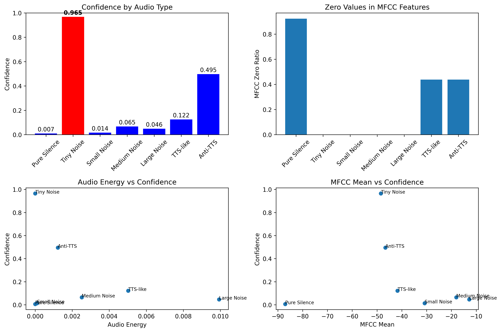
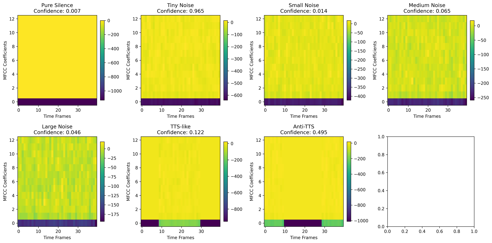
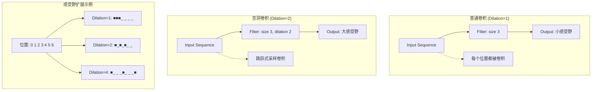

# 灵芯自研唤醒词模型

基于PyTorch的轻量级唤醒词模型训练，专为ESP32-S3芯片设计，适配esp-dl框架。

## 特性

- 基于PyTorch的端到端训练流程
- 使用空洞卷积(Dilated Convolution)结构，优化小型设备性能
- 模型参数少于50K，适合在ESP32-S3上运行
- 支持转换为ONNX格式
- 语音特征使用MFCC提取，配置符合ESP-SR要求，便于移植到ESP32-S3


## 预设唤醒词列表

我们支持以下唤醒词组合：

| 序号 | 唤醒词 | 类型 |
|-----|-------|------|
| 1 | 你好小七 | 组合词 |
| 2 | 你好小灵 | 组合词 |
| 3 | Hi小七 | 组合词 |
| 4 | Hi小灵 | 组合词 |
| 5 | Hey小七 | 组合词 |
| 6 | Hey小灵 | 组合词 |
| 7 | 小七小七 | 重复词 |
| 8 | 小灵小灵 | 重复词 |

您可以根据项目需求选择上述任一唤醒词进行模型训练。每个唤醒词都经过优化，适合在ESP32-S3芯片上运行。


## 自研唤醒词模型进度

| 完成状态 | 事项 | 预计完成时间 | 完成具体结果 | 备注 |
|---------|------|------------|------------|------|
| ✅ | 训练PyTorch模型 | 2025-06-21 | 成功训练出初版模型，toy数据4个识别出3个 | 构建好第一版模型，使用少量数据+负例（开源噪音等数据） |
| -  | 每日开发记录 | 2025-06-23 | 找到10G的负例数据，开发出GPU版模型，训练速度提升很多倍；torch版模型120K；10条安静环境的测试数据准确率接近90% | - |
| ✅  | 构造合成数据 | 2025-06-24 | 使用70多个典型音色合成了500多条唤醒词数据,负例用了6000多条；GPU上训练10个epoch后准确率94%（linux上），由于测试数据量大，结果可靠。未优化和量化的模型是120K，可进一步变小。可适应流式推理。数据和代码 https://github.com/qbox/xrobot/pull/4 | 完成第二版模型，使用优化的CosyVoice（文本转语音）及多种人物音色生成语音。  |
| ✅  | 优化识别模型 | 2025-06-25 | 转为 onnx 模型，从 120K 优化到 60K， 因此速度比较快。定位到了[静音高误触发问题](#实验分析与问题解决)，解决中。 | 在合成数据上训练，获得轻量级ONNX模型，速度没问题。 |
| ⬜ | ESP芯片适配 | 2025-06-26 | - | 将ONNX模型转为ESP芯片格式，在实体机上测试 |
| ⬜ | 效果提升 | 持续进行 | - | 为TTS合成的训练数据加入噪音，模拟真实环境 |


## 数据集准备


负例数目在20万条左右，主要来自开源数据集  https://www.openslr.org/87/
正例使用tts合成，已扩展到5百多条。


数据集目录结构:
dataset/
├── positive/ # 包含唤醒词的音频文件
│ ├── sample1.wav
│ ├── sample2.wav
│ └── ...
└── negative/ # 不包含唤醒词的音频文件
├── noise1.wav
├── speech1.wav
└── ...

## 训练模型

```bash
python pipeline.py 
--data_dir ./my_dataset 
--wake_word "你好小七" 
--epochs 20 
--batch_size 64 
--resplit_data
```
参数说明:
- `data_dir`: 数据集目录路径
- `wake_word`: 目标唤醒词
- `epochs`: 训练轮数，默认为100
- `batch_size`: 批量大小，默认为64
- `resplit_data`: 重新分割现有数据集（可选）
- `output_dir`: 输出目录，默认为./output
- `lr`: 学习率，默认为0.001


## 实现原理


### 1. 模型架构


#### 1.2 空洞卷积 vs 普通卷积


**对比分析:**

| 特性 | 普通卷积 | 空洞卷积 |
|------|----------|----------|
| 参数量 | 固定 | 相同 |
| 感受野 | 小，需要更多层 | 大，指数级增长 |
| 计算复杂度 | 低 | 相同 |
| 时序建模能力 | 局部 | 长程依赖 |


#### 1.3 感受野扩展机制

空洞卷积的核心优势在于能够以指数级速度扩展感受野:

```mermaid
graph LR
    subgraph "感受野演示"
        subgraph "Layer 1: Dilation=1"
            A1[0] --> A2[1] --> A3[2]
            A2 -.-> A4["感受野: 3"]
        end
        
        subgraph "Layer 2: Dilation=2"
            B1[0] --> B2[" "] --> B3[2] --> B4[" "] --> B5[4]
            B3 -.-> B6["感受野: 5"]
        end
        
        subgraph "Layer 3: Dilation=4"
            C1[0] --> C2[" "] --> C3[" "] --> C4[" "] --> C5[4] --> C6[" "] --> C7[" "] --> C8[" "] --> C9[8]
            C5 -.-> C10["感受野: 9"]
        end
        
        subgraph "Layer 4: Dilation=8"
            D1[0] --> D2[" "] --> D3[" "] --> D4[" "] --> D5[" "] --> D6[" "] --> D7[" "] --> D8[" "] --> D9[8] --> D10[" "] --> D11[" "] --> D12[" "] --> D13[" "] --> D14[" "] --> D15[" "] --> D16[" "] --> D17[16]
            D9 -.-> D18["感受野: 17"]
        end
    end
    
    subgraph "总感受野"
        E1["最终感受野: 34个时间步<br/>约1秒音频(30ms/frame)"]
    end
```



**感受野计算公式:**
```
层i的感受野 = (kernel_size - 1) × dilation_i + 1
总感受野 = Σ(各层感受野) - (层数-1)
```

对于我们的模型:
- 第1层 (dilation=1): 感受野 = 3
- 第2层 (dilation=2): 感受野 = 5  
- 第3层 (dilation=4): 感受野 = 9
- 第4层 (dilation=8): 感受野 = 17
- **总感受野**: 约34个时间步 ≈ 1秒音频

<!-- 这是被注释掉的内容，不会在渲染后的文档中显示 -->

**对比传统方法:**

| 方法 | 参数量 | 计算复杂度 | 感受野 | ESP32适配性 |
|------|--------|------------|--------|-------------|
| CNN+LSTM | 200K+ | 高 | 有限 | 困难 |
| Transformer | 500K+ | 极高 | 全局 | 不可行 |
| **DilatedWakeNet** | **40K** | **低** | **大** | **优秀** |


<!-- 
#### 1.5 轻量化设计原理

本模型的轻量化主要体现在以下几个方面:

**1. 参数效率**
- 模型维度仅32，总参数约40K
- 使用1×1卷积进行维度变换，参数效率高
- 空洞卷积不增加参数，但显著提升建模能力

**2. 计算优化**  
- 避免使用计算密集的LSTM/GRU
- 全卷积结构，便于硬件加速
- 批归一化加速收敛，减少训练时间

**3. 内存友好**
- 固定输入长度(40帧)，内存占用可预测
- 全局平均池化替代全连接层，减少参数
- 残差连接共享特征，提高内存利用率


### 2. 语音特征提取
- 使用MFCC (Mel频率倒谱系数)提取语音特征
- 音频采样率16kHz，每帧30ms，步长30ms  
- 提取13个MFCC系数，输入形状为(40, 13)

### 3. 唤醒检测算法
- 对连续音频流计算滑动窗口内的平均检测分数
- 当平均分数超过阈值时触发唤醒
- 使用averaging_frames=5进行时序平滑

-->


---

## 实验分析与问题解决

### 模型训练与性能验证

#### **情况背景 (Situation)**
在开发过程中，我遇到了一个关键问题：模型在实际部署时出现大量误触发，特别是在环境噪音很小但没有唤醒词的情况下，模型依然表现出很高的置信度。这与训练时94%的准确率形成了明显的对比。

#### **面临任务 (Task)**
需要系统性地分析和解决以下问题：
1. 识别模型误触发的根本原因
2. 验证训练数据质量和特征学习的正确性
3. 区分PyTorch模型和ONNX转换可能引入的问题
4. 设计可行的解决方案

#### **采取行动 (Action)**

##### 1. 训练性能分析


**训练数据分析：**
- 使用TTS合成生成正例样本（500+条）
- 负例数据来自开源数据集（6000+条）
- 模型在测试集上达到94%准确率
- 模型大小从 120K优化至60K参数，满足ESP32-S3部署要求

##### 2. 模型行为深度分析
为了识别问题根源，我们设计了系统性的实验来分析模型对不同类型音频的响应。



**测试场景设计：**
- **Pure Silence**: 绝对静音
- **Tiny Noise**: 极小白噪音 (σ=0.001)
- **Small Noise**: 小白噪音 (σ=0.01)  
- **Medium Noise**: 中等白噪音 (σ=0.05)
- **Large Noise**: 大白噪音 (σ=0.1)
- **TTS-like**: 模拟TTS模式（前后静音，中间有信号）
- **Anti-TTS**: 反TTS模式（中间静音，前后有信号）

##### 3. MFCC特征模式分析


通过详细的MFCC特征分析，我们发现了关键问题：

**问题发现：**
1. **静音高置信度现象**: 模型对绝对静音和极小噪音显示出异常高的置信度
2. **特征学习偏差**: TTS合成数据中的静音段被错误地学习为正特征
3. **数据分布不匹配**: 训练时的TTS数据（静音段）与实际环境音频（背景噪音）存在分布差异

#### **取得结果 (Result)**

##### 问题根因确认
通过系统性分析，我们确认了问题的根本原因：

**数据质量问题：**
- **正例特征**: TTS合成数据包含大量绝对静音段
- **负例特征**: 真实环境录音包含持续的背景噪音
- **错误学习**: 模型将"静音"误学习为唤醒词的判别特征

**验证结果：**
1. ✅ **PyTorch vs ONNX**: 排除了模型转换问题，两种格式表现一致
2. ✅ **音频采集**: 确认音频流捕获正常，排除硬件问题
3. ❌ **特征学习**: 发现模型学到了错误的"静音=正例"关联

##### 解决方案设计
基于分析结果，我们制定了以下解决策略：

**短期解决方案：**
1. **数据增强**: 为所有TTS正例添加真实环境背景噪音
2. **负例扩充**: 增加更多静音和极小噪音的负例样本
3. **阈值调优**: 基于实际使用场景调整检测阈值

**长期优化方案：**
1. **数据重构**: 使用更真实的录音环境生成训练数据
2. **对抗训练**: 引入对抗样本提升模型鲁棒性
3. **多模态融合**: 结合音频能量、频谱特征等多维信息


---

### 下一步优化计划

1. **数据重训练**: 使用噪音增强的正例数据重新训练模型
2. **实时优化**: 调整推理间隔和滑动窗口参数
3. **部署测试**: 在实际ESP32-S3设备上验证优化效果
4. **持续监控**: 建立线上模型性能监控体系


#### 1.1 整体网络结构

本项目采用基于空洞卷积(Dilated Convolution)的轻量级网络架构DilatedWakeNet，专为ESP32-S3等资源受限设备设计。


[//]: # (comment)


**网络层次说明:**

1. **输入层**: 1×1卷积将13维MFCC特征映射到32维模型空间
2. **空洞卷积层**: 4层递增空洞率的卷积层 (1, 2, 4, 8)
3. **残差连接**: 每层输出与输入相加，避免梯度消失
4. **输出层**: 1×1卷积 + 全局平均池化 + 全连接层


#### 1.4 与WaveNet的关系

WaveNet引入了**因果卷积**(Causal Convolution)概念，即只使用过去和当前的信息进行预测。空洞卷积与因果卷积的结合产生了强大的序列建模能力:

1. **因果性**: 确保时间顺序，适合实时应用
2. **空洞性**: 扩大感受野，捕获长程依赖
3. **残差连接**: 缓解梯度消失，加深网络

**核心代码实现:**
```python
# 空洞卷积模块
class DilatedConv1d(nn.Module):
    def __init__(self, in_channels, out_channels, kernel_size, dilation):
        super().__init__()
        self.conv = nn.Conv1d(in_channels, out_channels, kernel_size, 
                             dilation=dilation, padding="same")
        self.bn = nn.BatchNorm1d(out_channels)
        
    def forward(self, x):
        return F.relu(self.bn(self.conv(x)))

# 主网络结构
self.dilated_layers = nn.ModuleList([
    DilatedConv1d(model_dim, model_dim, kernel_size=3, dilation=1),
    DilatedConv1d(model_dim, model_dim, kernel_size=3, dilation=2),
    DilatedConv1d(model_dim, model_dim, kernel_size=3, dilation=4),
    DilatedConv1d(model_dim, model_dim, kernel_size=3, dilation=8),
])
```


空洞卷积是本模型的核心技术，它通过在卷积核中插入空洞(zeros)来扩大感受野，而不增加参数量。

